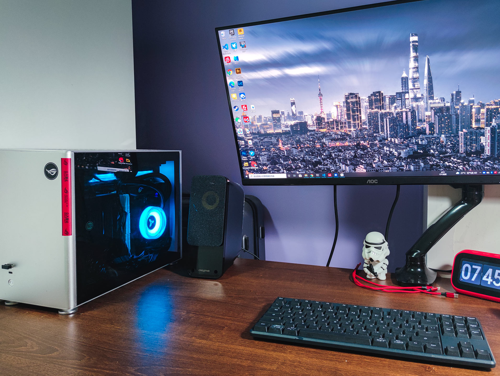

家里的macbook pro越来越不堪重负了，动不动就是死机重启！由于我业余爱好摄影，时不时的会用电脑处理些照片。家里8G的内存的macbook pro实在不堪重负，动不动就给我来个死机重启，这谁受得了。

真好趁着前一段时间的618促销，自己组了一台电脑。说实在的这还是我第一次组装自己的电脑，还挺激动的。从下单到组装，中间并不是很顺利，在这记录一下。

这是电脑整个组装完的样子

我个人的需求还是很明确的，组装一台平常使用的电脑。我平常做的最耗电脑性能的事就是处理照片了，特别是处理延时的时候，原来的电脑同时处理几百张照片的时候，电脑风扇直接飞起，内存直接爆炸，过不久整个电脑就完全没反应，然后就自己重启了，真真气死个人。新的电脑不要求配置很高，只要这种最繁重的任务能够处理得了就行。另外电脑要尽量少占空间。

在618奋战了好多天之后，最终拿到了所有的配件

| 部件     | 型号                        | 价格      |
| -------- | --------------------------- | --------- |
| CPU      | AMD 5600x                   | 1577.4    |
| 机箱     | 乔思伯 A4 v1.1              | 456       |
| 主板     | 华硕 ROG STRIX B550-I       | 1579      |
| 内存     | 英睿达 铂胜 16G 3200mhz x 2 | 558 + 481 |
| 硬盘     | 铠侠 RC10 500G SSD          | 389       |
| 散热器   | 乔思伯 天使眼 240水冷       | 305       |
| 电源     | 全汉 MS600G 600W SFX电源    | 581       |
| 风扇     | 乔思伯 12020 12cm机箱风扇   | 16        |
| **合计** |                             | 5,942.4   |

最终选择了ITX方案，这并不是最具性价比的方案。我算了下如果不组ITX主机我大概能少花1000块。这大纲的就是花钱买自己开心吧。。ITX方案带来的占地面积小真的很方便，再加上主机颜值高随便摆在桌面上看着也很享受。

刚开始的时候买的微星的主板，死活都的点不亮。拿到下面电脑店看一下，刷BOIS过程中被老板娘了一下插头直接断电。又和他们撕逼了好久，最后无奈不想折腾了只能退货了。然后又重新买了华硕的主板，买了一次性点亮，看来微星还是不行啊！

忘了说了，显卡用了之前的显卡（R9 nano），之前给MacBook当外置显卡用的（事实证明这个方案并不靠谱）。现在这个事情，显卡贵的实在离谱，先用就显卡撑着，之后显卡降价再说，何况这个显卡也基本上完成了我现在的大部分需求（巫师3竟然能4K画质不卡，吃惊！）。

总体来说我对这个主机还是非常满意的。处理照片再也不卡了，32G内存随便用。我又把我之前两个3.5寸硬盘也装进来了，一个12TB、一个3TB，磁盘空间非常充足了，照片也有地方放了。

只是装ITX有毒，装完之后总想不停的折腾，更小的机箱、更好的散热、不同的ITX解决方案... 看着总想折腾

要控制自己... 折腾起来太没完没了了

